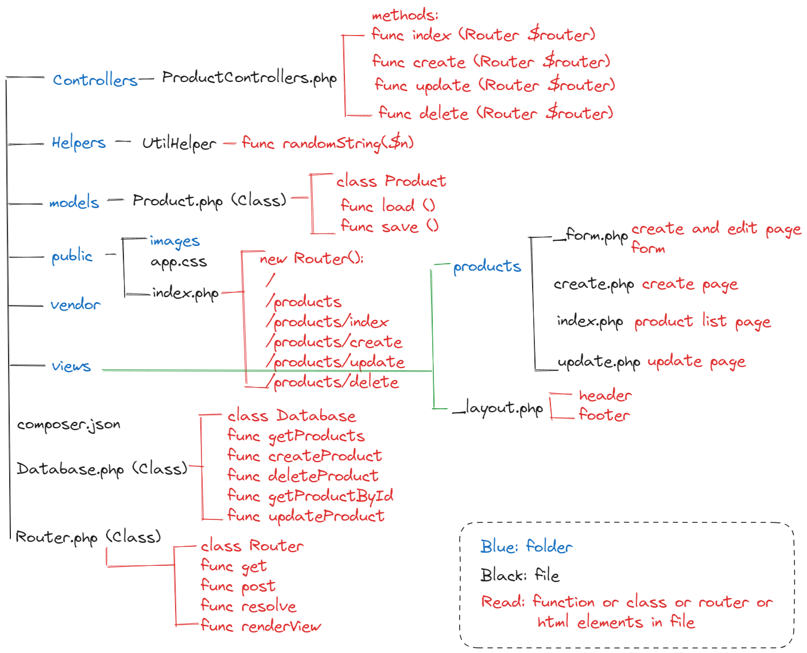

# PHP Crash Course

<div align="center">


</div>

### Learning PHP course follow the video tutorial [TheCodeholic](https://www.youtube.com/watch?v=2eebptXfEvw&t=907s&ab_channel=TraversyMedia)

The course covers all the basic things about PHP.
localhost server `http://localhost:4433/php-crash-course-2020/`

- ✅ Comments
- ✅ Variables
- ✅ Numbers
- ✅ Strings
- ✅ Arrays
- ✅ Conditionals
- ✅ Loops
- ✅ Functions
- ✅ Dates
- ✅ Including PHP files
- ✅ Working with File System
- ✅ Object Oriented PHP (OOP)
- ✅ CURL
- Product CRUD
  - Working with forms <br>
    ✅ MySQL <br>
    ✅ Boostrap <br>
    ✅ Form validation (error popup with wrong input and mysql can varify the input data) <br>
  - File uploading and file validation <br>
    ✅ Uploading Image file w unique name<br>
    ✅ Delete and Update Product <br>
    ✅ Improve CRUD: code refactoring <br>
    ✅ Create virtual host or php build-in server <br>
    ```bash
    php -S localhost:8080
    ```
  - Working with mysql
- Composer and autoloading <br>
  - ✅ Name Space & Autoloading with composer <br>
  - MVC framework with Custom Routing <br>
    1. ✅ MVC Controller <br>
    2. ✅ MVC View <br>
    3. ✅ MVC Model <br>
  - Set Apache Virtual Hosts <br>

## 📝 Project Structure

In `14_product_crud` folder, there are 1 folder named `03_mvc` which is the final e-commerce project using MVC framework with custom routing. And the project framework is following: <br>


</img> <br>
